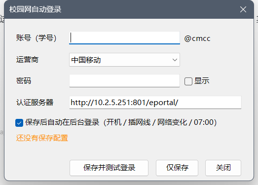

# net-switch —— 有线没出口时自动改走手机热点（Windows，不拔网线）

宿舍/办公室的**有线网按时间停认证**（例如某校"周日至周四 23:30 停止上网认证，次日 7:00 恢复，周五、周六及节假日不断网"），
可网线还插着、链路和网关都活着 —— 于是出现这个经典现象：

> **插着网线时连手机热点也上不了网，把网线拔了立刻就好。**
>
> 本项目还会在**有线在线但需要认证**时，用你保存的账号自动认证校园网（见「校园网自动认证」）。

## 原因

Windows 按**接口跃点数**选默认路由和 DNS：有线自动 25 < 无线自动 50（数值小=优先）。
有线只是"停止认证/出口被掐"，链路仍然是 Up、网关仍然 ARP 应答，Windows 不会改判，
默认路由和 DNS 查询继续交给那条**没有出口的有线**：数据包进黑洞，DNS 永远超时。
热点侧 IP 再通也没用 —— **要改的是跃点优先级，不是热点。**

> 附带一层：开着 Clash Verge 等的 **TUN 模式**（虚拟网卡如 `Meta`，跃点 0）时，
> 它会用跃点 0 的默认路由接管全部公网流量，但它自己不产生出口，
> 出站仍搭在**物理默认路由**上 —— 物理层选错，代理层一起断。改跃点对两层同时生效。

## 做法

不改网卡状态、不删路由、不用拔线：**只调接口跃点**，并且靠**逐接口真实出口探测**决定谁优先。

判定与动作（每轮）：

| 有线能出网 | 热点能出网 | 动作 |
|---|---|---|
| 是 | — | 两块卡都恢复"自动跃点"（有线 25 优先，**不耗手机流量**） |
| 否 | 是 | 热点跃点 = 10，有线 = 90（公网走热点，**有线同网段内网照旧可达**） |
| 否 | 否 | 不动 |

探测是核心：把 socket **绑定到各网卡自己的本机地址**再连 `223.5.5.5:443`（TCP 放行而 ICMP 被墙的网络里也准，ICMP 兜底）。
绑定源地址会把路由查找钉死在这块卡上 —— 这块卡没出口时 Windows 直接报
"向一个无法连接的网络尝试了一个套接字操作"，**不会偷偷从别的网卡出去**，所以判定比看链路状态可靠得多。
（`Test-NetConnection` / `Test-Connection` 不能指定源地址，测的是系统选路，看不出单条线路的死活。）

自动排除虚拟网卡，不参与选路：VMware / VirtualBox / Hyper-V / Tailscale / TAP- / Sangfor / ZeroTier /
WireGuard / Npcap / 蓝牙 / Wi-Fi Direct / Clash 的 `Meta` 等。

## 调度：三个隐藏窗口的计划任务，不轮询、不常驻

| 任务 | 触发 | 行为 |
|---|---|---|
| `NetSwitch-Night` | 每天 **23:30** | 每 60 秒探一次，**一旦确认有线真的断了**就把热点设为优先，然后**立刻退出**；到点还没断就什么都不做（周五六、节假日不断网的日子靠这个自动跳过，不需要维护校历） |
| `NetSwitch-Morning` | 每天 **07:00** | 等到**确认有线恢复上网**就恢复自动跃点，然后**立刻退出**；最晚等到 07:45 |
| `NetSwitch-Campus` | 登录后 **立即** | 只做校园网认证，**不等选路那 30 秒**；网卡还没拿到 IP 就地每 2 秒探一次（最多 40 秒），拿到就认证 |
| `NetSwitch-Logon` | 登录 **+ 网络状态变化时** | 自动判断一次：插上网线且有线上网 → 5 秒后切回有线优先；校园网刚停认证 → 立刻切热点。事件触发（`Microsoft-Windows-NetworkProfile/Operational` 的 4004/10000/10001），不轮询 |

三个任务都用 **XML 创建**，因为命令行给不了这些开关：`Hidden=true`（不显示窗口）、
`StartWhenAvailable=true`（错过时间点尽快补跑，笔记本睡眠场景关键）、
`DisallowStartIfOnBatteries=false`（电池供电也跑）、`RunLevel=HighestAvailable`（不弹 UAC）。

实测开销（单机）：一次运行墙钟约 0.8 秒、CPU 约 0.7 秒（其中 ~0.55 秒是启动 PowerShell 的开销），
进程退出即释放内存，**没有常驻进程**；白天只在网络状态变化时才跑约 3 秒。

> 提醒：别用"每分钟一个计划任务"的轮询写法 —— 逻辑再对，用户先看到的是**每分钟闪一个黑窗口**。

## 用法

```
net-switch.ps1 -Mode status      # 只读：列出每条线路能否出网、当前跃点、系统会把公网流量交给谁
net-switch.ps1 -Mode install     # 装三个计划任务（需管理员，会弹 UAC）
net-switch.ps1 -Mode uninstall   # 卸任务 + 结束残留进程 + 还原自动跃点
net-switch.ps1 -Mode auto        # 单次判断并切换（兜底/事件触发用）
net-switch.ps1 -Mode settle -Until wireddown -MaxMinutes 20   # 定点任务：等到有线断就切热点
net-switch.ps1 -Mode settle -Until wiredup   -MaxMinutes 45   # 定点任务：等到有线通就切回
net-switch.ps1 -Mode hotspot / campus                          # 手动强制
```

参数（脚本顶部）：`-Interval` 探测间隔、`-NightTime` / `-MorningTime` 两个时间点、
`-NightMinutes` / `-MorningMinutes` 最长等待、`-AltMetric` / `-WiredMetric` 跃点值、`-DryRun` 演练。
换成自己的时间点只需改 `-NightTime` / `-MorningTime`。

Windows 上直接双击同目录的 `.bat` 即可（`查看状态` / `切到手机热点` / `切回有线优先` / `校园网登录设置` / `安装-夜间自动切换` / `卸载-自动切换`）。

## 校园网自动认证（可选）

有线插着、却上不了网，其实只是**校园网没认证**时 —— 会先用你保存的账号自动认证一次，再决定走哪条线，不用再开浏览器点门户。

图形界面：双击 **`校园网登录设置.bat`**（账号填学号，运营商可选 移动 / 联通 / 电信 / 校园网）



- **密码用 Windows DPAPI 加密**后存放在 `%APPDATA%\net-switch\campus.json`（只有本机当前用户能解密），不落明文、也不进仓库
- 协议：Dr.COM ePortal，`GET /eportal/?c=Portal&a=login&login_method=1&user_account=<学号+运营商后缀>&user_password=<密码>&wlan_user_ip=<有线网卡IP>`
  （后缀 `@cmcc` / `@unicom` / `@telecom` / 校园网无后缀）；响应是 `dr1003({...})`，
  **按 `result`/`msg` 判断真实成败**（HTTP 200 并不等于登录成功），GBK 编码响应自动兜底解码
- 触发时机：**开机登录后立即**（认证与选路拆成两个任务：认证不等，选路判定延后 30 秒，避免开机瞬间网络栈没就绪时误判）
  / 插网线或网络状态变化 +5 秒 / 每天 07:00 —— 都是隐藏窗口，不轮询、不常驻
- 带频率限制与失败退避（默认失败后 30 分钟内不再重试），不会反复打扰认证服务器
- 命令行：`campus-login.ps1 -Mode status | login | forget | gui`，加 `-Force` 可强制认证一次
- 给 net-switch 传 `-NoCampusLogin` 可关掉"自动认证"这一步

> 协议参数参考 [snowsong42/CUMT_SchoolNet_tk_GUI](https://github.com/snowsong42/CUMT_SchoolNet_tk_GUI)（该校 ePortal 的登录方式）；
> 代码按协议重写，未复制其源码（对方仓库未附许可证）。该功能只是用你自己的账号做正规认证，
> **不会也不能绕过学校夜间停止认证的策略**。

## 打包成 EXE（单文件分发）

```powershell
powershell -ExecutionPolicy Bypass -File build\build-exe.ps1     # 产物：dist\net-switch.exe（约 57 KB）
```

- **不需要安装任何东西**：用 Windows 自带的 `csc.exe` 编译，两个 `.ps1` 作为内嵌资源打进 exe；运行时依赖系统自带的 PowerShell 5.1。
- **双击直接出设置界面**（无参数 = `campus-login.ps1 -Mode gui`）；命令行用法与脚本一致：
  `net-switch.exe -Mode status` / `-Mode install` / `-Mode settle -Until wireddown`
  （`-Mode gui|login|forget` 自动路由到 campus-login，其余走 net-switch）
- **窗口行为**：编译为控制台子系统，启动器会检查"这个控制台是不是我自己创建的"——是（计划任务/双击）就立刻隐藏窗口，**不闪黑框**；从终端运行时保持可见、输出与退出码照常。
- 首次运行把脚本释放到 `%LOCALAPPDATA%\net-switch\bin\<版本>\`；日志与状态写在 **exe 所在目录**（由启动器通过 `NETSWITCH_HOME` 指定）。
- ⚠️ exe 里的脚本是**打包那一刻的快照**，改完 `.ps1` 要重新编译；所以计划任务默认仍指向 `.ps1`（永远是最新代码）。想让任务改调 exe：`net-switch.exe -Mode install`。
- ⚠️ 内嵌脚本**不是加密**的，谁都能从 exe 里提取 —— 别往脚本里写密码（本项目密码走 DPAPI 单独存储）。

## 手动等价操作

```powershell
# 热点优先
Set-NetIPInterface -InterfaceAlias "WLAN"   -AddressFamily IPv4 -InterfaceMetric 10
Set-NetIPInterface -InterfaceAlias "以太网" -AddressFamily IPv4 -InterfaceMetric 90
# 还原（等价 netsh interface ipv4 set interface "以太网" metric=automatic）
Set-NetIPInterface -InterfaceAlias "以太网" -AddressFamily IPv4 -AutomaticMetric Enabled
```

图形界面：`网络和共享中心 → 更改适配器设置 → 网卡属性 → IPv4 → 属性 → 高级 → 取消"自动跃点"，填跃点数`。

## 注意事项

1. 早上恢复后，认证门户可能要求重新登录一次（账号被踢过）。
2. 如果改完跃点 Clash 仍然"没网"：重启一次 Clash Verge / 重开 TUN，让它按 `auto-detect-interface` 重新跟随物理默认接口。
3. 脚本含中文，**必须存成 UTF-8 with BOM**，否则 PowerShell 5.1 会按 ANSI 读成乱码（网卡别名也靠动态识别，不写死中文名）。
4. `.bat` 内容保持纯 ASCII，文件名可以是中文。

## License

MIT
